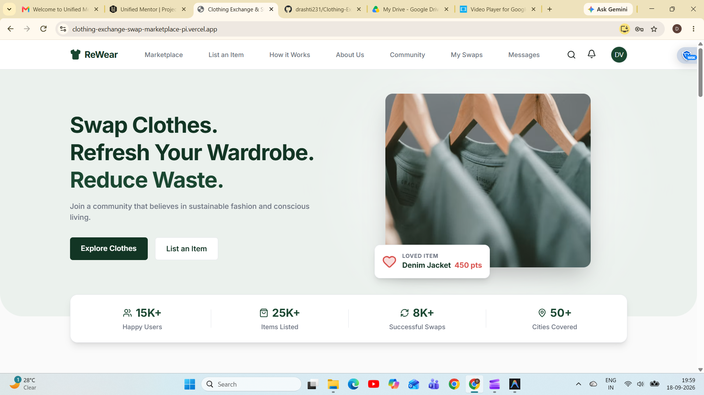
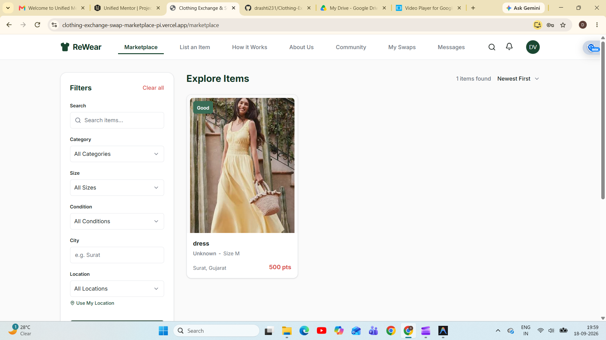
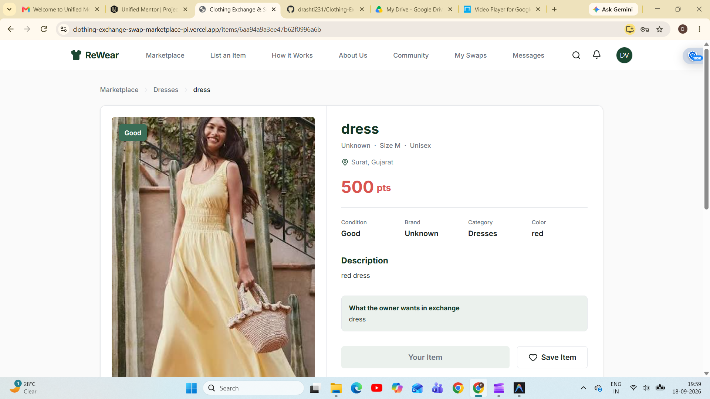
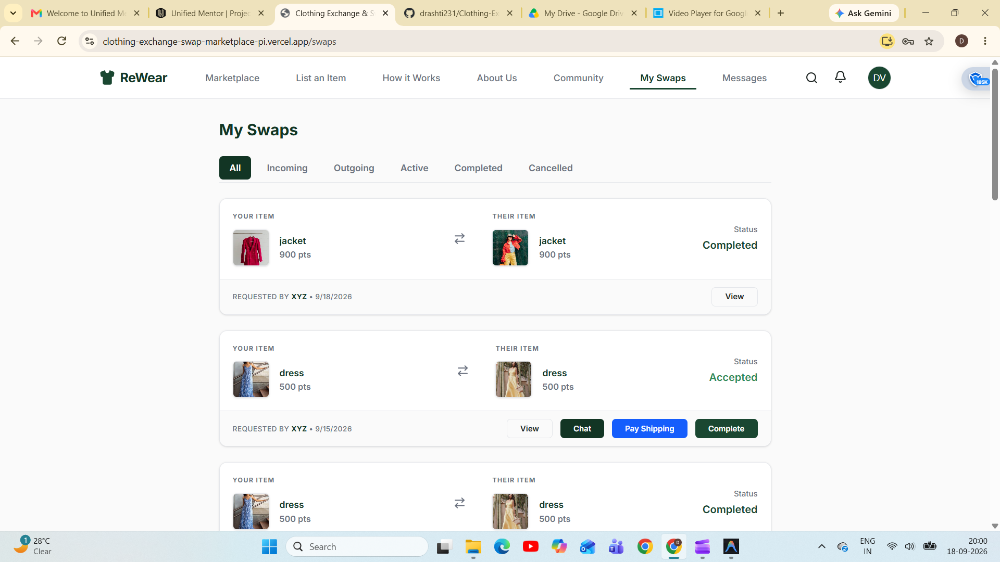
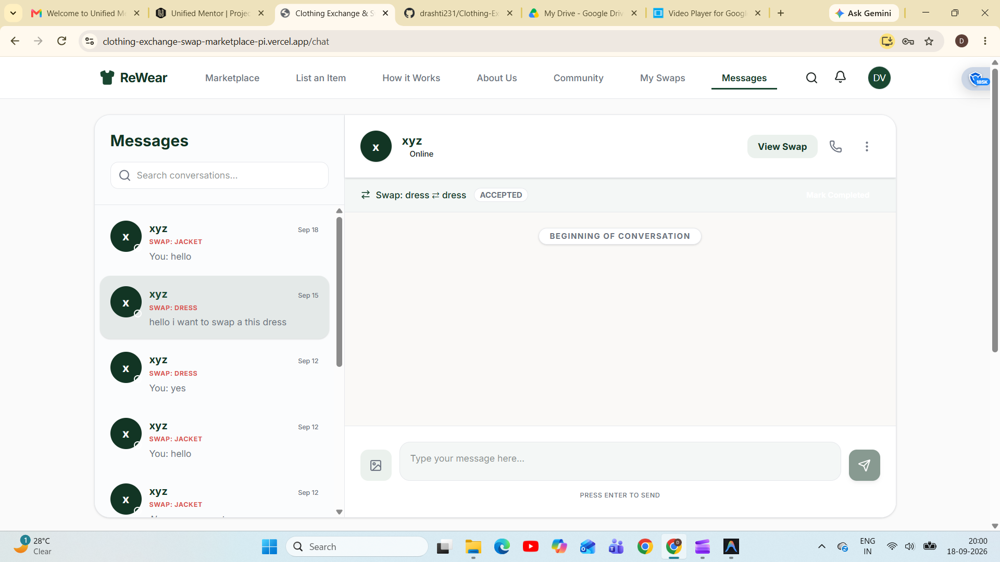
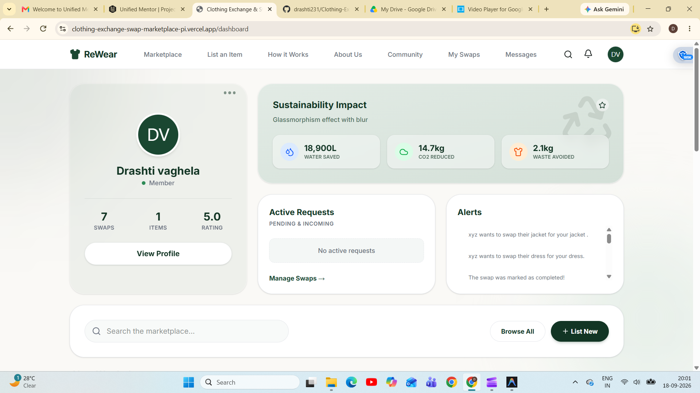

<div align="center">

# 👗 ReWear — Clothing Exchange & Swap Marketplace

### ♻️ Swap More. Waste Less. Wear Again.

<p align="center">
  <a href="https://clothing-exchange-swap-marketplace-pi.vercel.app/">
    
  </a>

  <a href="https://github.com/drashti231/Clothing-Exchange-Swap-Marketplace">
    
  </a>
</p>


</div>

---

# 🌍 About The Project

**ReWear** is a modern **Clothing Exchange & Swap Marketplace** developed to promote **sustainable fashion** and reduce textile waste.

Instead of buying new clothes, users can:

✅ List unused clothing  
✅ Discover clothing from other users  
✅ Send swap requests  
✅ Negotiate through chat  
✅ Compare swap values  
✅ Find nearby users  
✅ Complete clothing exchanges

The platform follows a **barter economy model**, encouraging clothing reuse and reducing environmental impact.


# ✨ Key Features

<table>
<tr>

<td width="50%">

### 👤 User System

- User Registration
- Login Authentication
- User Profile
- Edit Profile
- Protected Routes

</td>

<td width="50%">

### 👗 Clothing Listings

- Add Clothing
- Upload Images
- Edit Listings
- Delete Listings
- Availability Status

</td>

</tr>

<tr>

<td width="50%">

### 🔄 Swap System

- Send Requests
- Accept / Reject
- Swap History
- Status Tracking
- Swap Management

</td>

<td width="50%">

### 💬 Chat System

- Direct Messaging
- Negotiation
- Conversation History
- Swap Discussion

</td>

</tr>

<tr>

<td width="50%">

### 📍 Smart Filters

- Search
- Category Filter
- Size Filter
- Brand Filter
- Condition Filter
- Location Filter

</td>

<td width="50%">

### 🛠️ Admin Panel

- User Management
- Listing Management
- Swap Monitoring
- Reports & Analytics

</td>

</tr>
</table>

---

# 🔄 User Flow

text
Register/Login
      ↓
Create Profile
      ↓
List Clothing
      ↓
Browse Marketplace
      ↓
View Item
      ↓
Send Swap Request
      ↓
Chat & Negotiate
      ↓
Accept Swap
      ↓
Complete Exchange


---

# 🖼️ Screenshots

## 🏠 Home Page





## 👗 Marketplace





## 🔎 Item Details





## 🔄 My Swaps





## 💬 Chat





## 📊 Dashboard


## 🛠️ Admin Panel





---

# 🛠️ Tech Stack

| Layer | Technologies |
|---------|-------------|
| Frontend | React.js, Vite, Tailwind CSS |
| Backend | Node.js, Express.js |
| Database | MongoDB |
| Authentication | JWT |
| Real-Time | Socket.io |
| Deployment | Vercel |

---

# 📂 Project Structure

```text
ReWear/
│
├── client/
│   ├── components/
│   ├── pages/
│   ├── context/
│   ├── services/
│   └── assets/
│
├── server/
│   ├── controllers/
│   ├── models/
│   ├── routes/
│   ├── middleware/
│   └── config/
│
├── docs/
├── README.md
└── package.json


---

# 🌱 Project Objective

ReWear aims to:

♻️ Reduce textile waste  
👕 Promote clothing reuse  
🌍 Support sustainable fashion  
🤝 Build a sharing community  
💰 Encourage cost-effective fashion

---

# 🚀 Future Enhancements

- 🤖 AI Recommendations
- 📱 Mobile App
- 🌍 Sustainability Tracker
- ⭐ Review System
- 🚚 Courier Integration

---

# 🎓 Internship Project

This project was developed as part of a **Web Development Internship at Unified Mentor Pvt. Ltd.**

---

# 👩‍💻 Developer

<div align="center">

## Drashti Vaghela

🎓 BSc IT Student  
💻 Full Stack Web Developer

<p>
<a href="https://github.com/drashti231">

</a>

<a href="https://linkedin.com/in/drashti-vaghela-2626a7341/">

</a>
</p>

</div>

---

<div align="center">

### ⭐ If you like this project, give it a Star ⭐

Made with ❤️ for Sustainable Fashion

</div>
